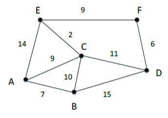

# Diskreetti matematiikka Tehtävä 11

## Dijkstran algoritmi

### 56.
Etsi oheisesta verkosta kevyin reitti pisteestä A pisteeseen F. Numerot kuvaavat solmujen välistä painoa. Käytä ratkaisemiseen Dijkstran algoritmia. Mikä reitti on paras ja mikä on sen paino?


* Reitti A -> C -> E -> F on paras, sillä sen paino on 20.

### 57.
Dijkstran algoritmilla voidaan ratkaista erittäin laajoja ongelmia, jos ratkaisuaika ei ole kriittinen tekijä. Esimerkiksi 5g verkon suunnittelussa sillä voidaan optimoida useiden tuhansien tukiasemien verkostoa. Etsi ratkaisut seuraaviin kysymyksiin:

* Miksi Dijkstran algoritmi ei yleensä ’tukehdu’ isoissakaan ongelmissa?
<br>

  * Dijkstran algoritmi käyttää tietorakennetta nimeltä prioriteettijono, joka varmistaa, että se käsittelee solmuja pienimmän etäisyyden mukaan ensin. Tämä vähentää huomattavasti tarvittavien laskutoimitusten määrää.
<br>
  * Dijkstran algoritmi käy läpi jokaisen solmun vain kerran, joten sen aikavaativuus on O(V log V + E), missä V on solmujen määrä ja E on kaarien määrä. Tämä aikavaativuus on melko tehokas, eikä se yleensä aiheuta ongelmia järkevän kokoisissa verkoissa.
<br>
  * Dijkstran algoritmi käyttää "leimattua" lähestymistapaa, jossa jokainen solmu merkitään käsitellyksi, kun se on käyty läpi. Tämä estää sen käsittelemästä samoja solmuja uudelleen, mikä vähentää huomattavasti tarvittavien laskutoimitusten määrää.
<br>

* Voiko painojen arvo olla negatiivinen, kun käytetään Dijkstran algoritmia?
<br>
  *  Dijkstran algoritmi on suunniteltu käsittelemään positiivisia kaarien painoja. Jos painot ovat negatiivisia, algoritmi voi antaa virheellisiä tuloksia tai jopa tukkeutua.


### 58.
Dijkstran algoritmille löytyy vino pino erilaisia sovelluksia. Linkin takana pari JavaScript-toteutusta. Tutustu niihin ja ratkaise tehtävän 56 sekä luentomateriaalissa olevan linkin takana olevan graafin lyhin reitti.

* Tehtävän 56 ratkaisu: A -> C -> E -> F (paino 20)
* Luentomateriaalin graafin ratkaisu: A -> B -> C -> D (paino 38)

Koodi löytyy [täältä](./dijkstra.py)
```python
import sys


class Graph(object):
    def __init__(self, nodes, init_graph):
        self.nodes = nodes
        self.graph = self.construct_graph(nodes, init_graph)

    def construct_graph(self, nodes, init_graph):
        '''
        This method makes sure that the graph is symmetrical. In other words, if there's a path from node A to B with a value V, there needs to be a path from node B to node A with a value V.
        '''
        graph = {}
        for node in nodes:
            graph[node] = {}

        graph.update(init_graph)

        for node, edges in graph.items():
            for adjacent_node, value in edges.items():
                if graph[adjacent_node].get(node, False) == False:
                    graph[adjacent_node][node] = value

        return graph

    def get_nodes(self):
        "Returns the nodes of the graph."
        return self.nodes

    def get_outgoing_edges(self, node):
        "Returns the neighbors of a node."
        connections = []
        for out_node in self.nodes:
            if self.graph[node].get(out_node, False) != False:
                connections.append(out_node)
        return connections

    def value(self, node1, node2):
        "Returns the value of an edge between two nodes."
        return self.graph[node1][node2]


def dijkstra_algorithm(graph, start_node):
    unvisited_nodes = list(graph.get_nodes())

    shortest_path = {}

    previous_nodes = {}

    max_value = sys.maxsize
    for node in unvisited_nodes:
        shortest_path[node] = max_value

    # The distance to the start node is 0
    shortest_path[start_node] = 0

    # The algorithm executes until we visit all nodes
    while unvisited_nodes:
        current_min_node = None
        for node in unvisited_nodes:
            if current_min_node == None:
                current_min_node = node
            elif shortest_path[node] < shortest_path[current_min_node]:
                current_min_node = node

        neighbors = graph.get_outgoing_edges(current_min_node)
        for neighbor in neighbors:
            tentative_value = shortest_path[current_min_node] + graph.value(current_min_node, neighbor)
            if tentative_value < shortest_path[neighbor]:
                shortest_path[neighbor] = tentative_value
                previous_nodes[neighbor] = current_min_node

        unvisited_nodes.remove(current_min_node)

    return previous_nodes, shortest_path


def print_result(previous_nodes, shortest_path, start_node, target_node):
    path = []
    node = target_node

    while node != start_node:
        path.append(node)
        node = previous_nodes[node]

    # Add the start node manually
    path.append(start_node)

    print("We found the following best path with a value of {}.".format(shortest_path[target_node]))
    print(" -> ".join(reversed(path)))

# Tehtävän 56 ratkaisu
nodes = ["A", "B", "C", "D", "E", "F"]
init_graph = {}
for node in nodes:
    init_graph[node] = {}

init_graph["A"]["B"] = 7
init_graph["A"]["C"] = 9
init_graph["A"]["E"] = 14
init_graph["B"]["C"] = 10
init_graph["B"]["D"] = 15
init_graph["C"]["D"] = 11
init_graph["C"]["E"] = 2
init_graph["D"]["F"] = 6
init_graph["E"]["F"] = 9

graph = Graph(nodes, init_graph)

previous_nodes, shortest_path = dijkstra_algorithm(
    graph=graph,
    start_node="A")

print_result(
    previous_nodes, shortest_path, start_node="A", target_node="F")

nodes = ["A", "B", "C", "D"]
init_graph = {}
for node in nodes:
    init_graph[node] = {}

init_graph["A"]["B"] = 10
init_graph["A"]["C"] = 19
init_graph["B"]["C"] = 8
init_graph["B"]["D"] = 31
init_graph["C"]["D"] = 20

graph = Graph(nodes, init_graph)

previous_nodes, shortest_path = dijkstra_algorithm(
    graph=graph,
    start_node="A")

print_result(
    previous_nodes, shortest_path, start_node="A", target_node="D")

```


#### Aman Mughal 03/04/2023