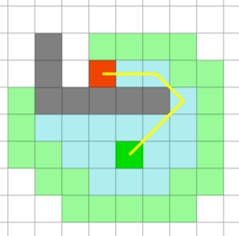

# Diskreetti matematiikka Tehtävä 12

## A *-algoritmi

### 59.
Etsitään lyhin reitti välille A → B. Tummennetun alueen läpi ei pysty kulkemaan. Siirtyminen ylös/alas tai sivulle: pituus = 10. Siirtyminen viistoon: pituus = 14. Käytetään ratkaisussa A*-algoritmia. Käytetään nyt jäljellä olevan matkan arviona h(x) ns. euklidista etäisyyttä (etäisyys linnuntietä pitkin). Mitkä ovat A*-algoritmin 2 ekaa siirtymää?
Huom : laskettaessa toista siirtymää otetaan mukaan myös ”vanhat” f(x) arvot.
Huom 2: tässä tehtävässä h(x) voidaan määrittää tarkasti. Yleisesti se on jokin heuristinen (’järkevä’) arvio jäljellä olevasta matkasta.

Vastaus: yläviistoon oikealle 2 kertaa

### 60.
Julkisista GitHub/GitLab -projekteista löytyy kaikenlaista. Esimerkiksi tämä: https://github.com/qiao/PathFinding.js/ Sen avulla voi selaimella visualisoida eri algoritmien toimintaa selaimellakin.

Tehtävä:
Piirrä ohjelmalla selaimellesi edellä oleva A* -tehtävän graafi. Millaisen reitin A* ja Dijkstra löysivät? Mitä heurestiikkaa (h(x)) käytit A* käytti jäljellä olevan matkan arviointiin? (A* alta löytyvä valikko) Lisää graafiin myös reunat Dijkstraa varten Palautuksena kuvaruutukaappaukset algoritmien reitistä.

A* -algoritmi: (h(x) = euklidinen etäisyys)

Dijkstra:

### 61.
Laskenta-algoritmien kehitys on ollut viime vuosikymmeninä huimaa. Myöskin nämä perinteiset ja erittäin tunnetut algoritmit Dijkstra ja A* ovat saaneet rinnalleen näiden pohjalta kehitettyjä uudempia versioita. Seuraava video https://www.youtube.com/watch?v=cSxnOm5aceA  vertailee 3 eri algoritmia :Dijkstra vs. A* vs. concurrent Dijkstra. Mikä näistä näyttää olevan nopein? Mitähän modernia ohjelmointitekniikkaa se näyttää käyttävän?
Huom: nyt tutkitaan tarvittavia iteraatioiden määrää, ei varsinaista suoritusnopeutta.

Vastaus: Concurrent Dijkstra on nopein, koska se käyttää useita säikeitä. A* on nopein, jos käytetään euklidista etäisyyttä. Se käyttää OpenGL+GLSL:ää.

## Ahneet algoritmit

### 62.
Lin-Kernighan Heuristic:ia (LKH) pidetään yhtenä parhaimmista algoritmeista. Saatko selville että mihin perusideaan tämä kehuttu algoritmi perustuu? (Hello, world -mieshän tässä…)

Vastaus:
* Lin-Kernighan Heuristic (LKH) on optimointialgoritmi, joka pyrkii löytämään lyhimmän mahdollisen reitin kahden pisteen välillä verkossa. Algoritmi perustuu kahdesta yksinkertaisesta ideasta: ensinnäkin se käyttää kahta reittiä, joita se yrittää optimoida samanaikaisesti, ja toiseksi se käyttää kahden optimaalisen reitin yhdistämistä.

#### Aman Mughal 10/04/2023