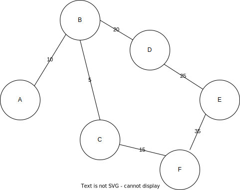
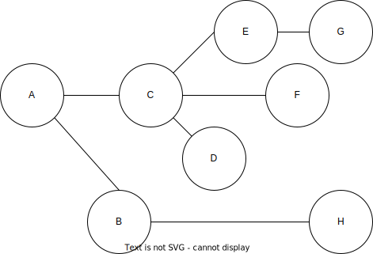
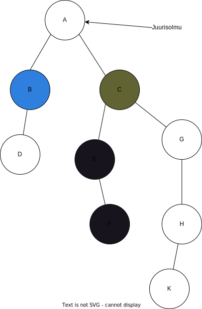

# Diskreetti matematiikka Tehtävä 9

## Graafiteoria, perusteet, puurakenteet

### Tehtävä 45.
Tee jokin
1. suuntaamaton mutta painotettu graafi, jossa on 6 solmua.
   - 
2. suunnattu mutta painoton graafi, jossa on 6 solmua.
    - 

### Tehtävä 46.
 Onko oheinen graafi
1. suuntaamaton ja painoton?
   - Kyllä, koska painoa ja kulkusuuntaa ei ole ilmoitettu.
2. puu?
    - Kyllä, koska kaikki siirtymät ovat yksikäsitteisiä.
3. binääripuu?
    - Ei, koska C:sta lähtee kolme haaraa. Binääripuussa haaroja saa olla korkeintaan 2.
4. jos graafi on puurakenne, niin kuinka helposti sen saa sellaiseksi, ettei se enää
ole puu? (tähän on varmasti erilaisia vaihtoehtoja ratkaista asia)
    - Rakennetaan vaikka B ja D kohdalle uusi polku. D ei ole enää yksikäsitteinen.
    - 

### Tehtävä 47.
Tehdään ed. tehtävän puusta ns. juurellinen puu ja määritellään solmu A puun
juurisolmuksi. Mikä on silloin solmujen A, G ja H syvyys?
- A: 0
- G: 3
- H: 2

### Tehtävä 48.
Oheisena on esitetty eräs binääripuu. Solmu ”A” on sen juurisolmu.
1. Kuinka monta lehtisolmua puulla on?
    - Niitä on 3. Ne ovat D, F ja K.
2. Mikä on solmun B korkeus?
    - 1.
3. Mikä on solmun C korkeus?
    - 3.
4. Mikä on koko binääripuun korkeus?
    - 4.
5. Kumpia on enemmän: vasemman- vai oikeanpuoleisia lapsisolmuja?
    - Vasemmanpuoleisia lapsisolmuja on enemmän


### Tehtävä 49.
Binääripuussa on 9 solmua, juurisolmu mukaan laskettuna. Binääripuulla täytyy
olla vähintään 3 lehtisolmua. Kuinka korkean binääripuun pystyt näillä ehdoilla
luomaan?

Tässä esimerkissä näkyy, että korkeus 3 on suurin mahdollinen korkeus.
```
          1
        /   \
      2      3
    / \     / \
  4   5    6    7
/  \
8   9
```

### Tehtävä 50.
Välipala: Noita keittää eliksiiriä. Eliksiirin on kiehuttava täsmälleen 9 min. Noidalla
on käytössä vain 4-min. ja 7-min tiimalasit. Miten hän saa ajan mitattuna oikein?

(Tehtävä lokakuun Dimensiolehdestä, tehtävä Anastasia Vlasovan käsialaa. Tosin tätä kahden tiimalasin ongelmaa käytetään paljon muuallakin, ilmeisesti tämä noita-teema on mainitun henkilön tuottama sovelma aiheesta.)

Jos 4 minuutin tiimalasi valutetaan puolilleen, siinä on vain 2 minuuttia hiekkaa, joten sen
valuttaminen loppuun vie vain 2 minuuttia. Laitetaan eliksiiri liedelle ja odotetaan, että tämä 2 minuuttia kuluu. Tämän jälkeen 7 minuutin tiimalasi laitetaan valumaan. Kun se on
tyhjentynyt kokonaan, on kulunut yhteensä 2+7=9 minuuttia ja eliksiiri voidaan ottaa pois
liedeltä.

#### Aman Mughal 20/03/2023